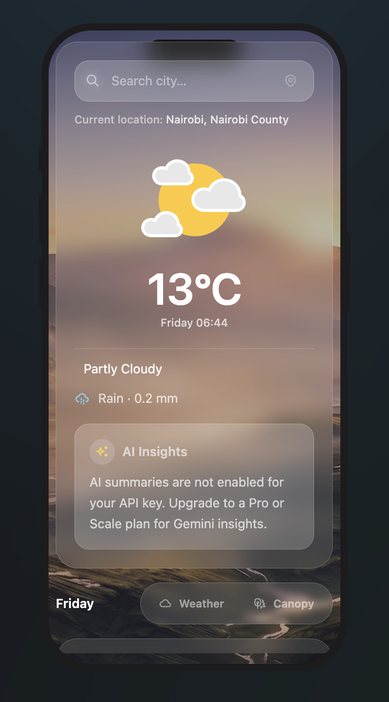
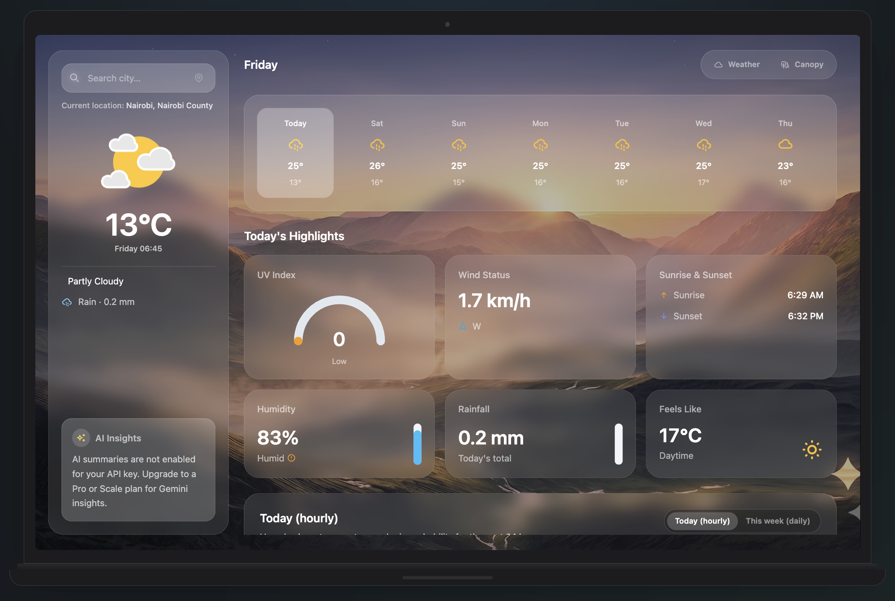
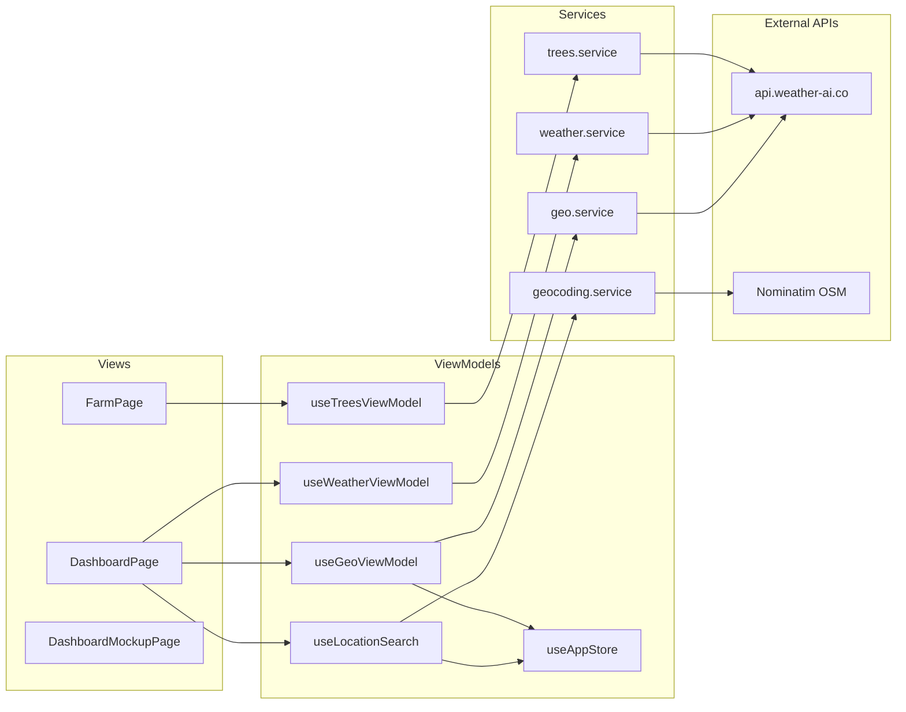

# Shamba Intel

**Weather-AI Integration Assessment — farmer-focused weather & canopy intelligence dashboard**

Shamba Intel is a React application built for the [Weather-AI](https://weather-ai.co) technical challenge. It consumes Weather-AI's REST APIs and presents localized weather intelligence alongside a tree-canopy analysis workflow aimed at smallholder farmers.

| | |
|---|---|
| **Repository** | [github.com/nalugala-vc/WAI](https://github.com/nalugala-vc/WAI) |
| **Live demo** | [wai-jade.vercel.app](https://wai-jade.vercel.app/) |
| **Device mockups** | [wai-jade.vercel.app/demo](https://wai-jade.vercel.app/demo) |
| **API docs** | [weather-ai.co/docs](https://weather-ai.co/docs) |

---

## Table of contents

1. [Overview](#overview)
2. [Screenshots](#screenshots)
3. [Features](#features)
4. [Architecture](#architecture)
5. [Weather-AI APIs implemented](#weather-ai-apis-implemented)
6. [Location search — solving the lat/lon-only constraint](#location-search--solving-the-latlon-only-constraint)
7. [Dynamic backgrounds & Lottie animations](#dynamic-backgrounds--lottie-animations)
8. [AI quota handling](#ai-quota-handling)
9. [Setup](#setup)
10. [Deployment](#deployment)
11. [Project structure](#project-structure)

---

## Overview

The Weather-AI platform exposes rich weather and forestry endpoints, but most coordinate-based routes require **`lat` and `lon`** — not a city name. The assignment challenge was to translate API data into a clean, functional product.

Shamba Intel addresses this by:

- Bootstrapping location via **`/v1/weather-geo`** (IP-based detection)
- Letting users **search any place by name** via a complementary geocoding layer (OpenStreetMap Nominatim), then feeding resulting coordinates into Weather-AI
- Rendering **condition-aware full-screen backgrounds** and **Lottie icons** that stay in sync with live API data
- Extending into **tree canopy analysis** using the Trees & Forestry API

The app uses a strict **MVVM** separation so API, state, and UI concerns remain testable and swappable.

---

## Screenshots

| iPhone | Laptop |
|--------|--------|
|  |  |

---

## Features

### Weather dashboard (`/`)

- IP-based geolocation on first load (`/v1/weather-geo`)
- Sidebar with search, live temperature, condition Lottie, rain line, AI summary slot
- 7-day forecast strip with day-click modal (Lottie + narrative copy)
- Today's highlights (UV, wind, humidity, sunrise/sunset, feels-like with unit conversion)
- Hourly / weekly temperature chart (Chart.js)
- °C / °F toggle
- Dynamic condition backgrounds with day/night and timezone-aware sunrise/sunset

### Canopy analysis (`/farm`)

- Image upload (drag-and-drop) with field metadata
- Tree count, canopy cover, health breakdown, observations & recommendations
- Analysis history sidebar and monthly quota badge
- Scan animation during upload

### Portfolio demo (`/demo`)

- Switchable device frames: iPhone, Android, iPad, Laptop
- Renders the real app (not a static mock) inside each frame

---

## Architecture

```
View (React pages/components)
        ↓
ViewModel (Zustand + TanStack Query)
        ↓
Service (Axios)
        ↓
Weather-AI API  |  Nominatim (geocoding only)
```

| Layer | Path | Responsibility |
|-------|------|----------------|
| **Model** | `src/models/` | TypeScript interfaces for API payloads |
| **Service** | `src/services/` | HTTP calls, response normalisation |
| **ViewModel** | `src/viewmodels/` | Caching, derived state, side effects — no JSX |
| **View** | `src/views/` | UI only — consumes ViewModels, never calls services directly |



**Stack:** React 18 · TypeScript · Vite · Tailwind CSS · React Router v6 · Axios · Zustand · TanStack Query · Chart.js · lottie-react · react-device-mockup

---

## Weather-AI APIs implemented

All requests use `Authorization: Bearer {VITE_WAI_API_KEY}`. Tree and weather fetch calls pass **`?ai=false`** to avoid consuming the monthly AI quota on the free plan while still receiving full forecast data.

### Weather & geo

| Endpoint | Method | Used in app | Purpose |
|----------|--------|-------------|---------|
| `/v1/weather-geo` | GET | `geo.service.ts` | IP-based location + bundled forecast on first load (`ip=auto`) |
| `/v1/weather` | GET | `weather.service.ts` | Primary dashboard payload: current, daily, location, optional AI summary |
| `/v1/hourly` | GET | `weather.service.ts` | 24-hour temperature & rain chart |
| `/v1/daily` | GET | `weather.service.ts` | 7-day highs/lows for forecast strip & weekly chart |
| `/v1/current` | GET | `weather.service.ts` | Implemented in service layer (available for future use) |
| `/v1/forecast` | GET | — | Defined in constants; bundled data used via `/v1/weather` instead |
| `/v1/insights` | GET | `weather.service.ts` | Implemented; query disabled on free tier (`enabled: false` in ViewModel) |

**Typical dashboard call pattern:**

```
1. GET /v1/weather-geo?ip=auto&days=7&lang=en&ai=false     → seed lat/lon + city
2. GET /v1/weather?lat=&lon=&days=7&units=&lang=&ai=false  → sidebar + summary
3. GET /v1/hourly?lat=&lon=&days=1&units=metric             → hourly chart
4. GET /v1/daily?lat=&lon=&days=7&units=metric&ai=false     → forecast strip
```

### Trees & forestry

| Endpoint | Method | Used in app | Purpose |
|----------|--------|-------------|---------|
| `/v1/trees/analyze` | POST | `trees.service.ts` | Multipart image upload + canopy analysis |
| `/v1/trees/history` | GET | `trees.service.ts` | Paginated past analyses |
| `/v1/trees/quota` | GET | `trees.service.ts` | Monthly analysis runs remaining |

---

## Location search — solving the lat/lon-only constraint

### The problem

Weather-AI's coordinate endpoints (`/v1/weather`, `/v1/hourly`, `/v1/daily`, etc.) accept **`lat`** and **`lon`** — not a city string. The geo endpoint (`/v1/weather-geo`) resolves the user's IP to coordinates, but there is no built-in "search for Nairobi" endpoint in the challenge scope.

Farmers think in **place names** (county, town, plot), not decimal degrees.

### The approach

We treat location as a **two-stage pipeline**:

```
User input  →  Resolve to coordinates  →  Weather-AI lat/lon APIs
```

#### Stage 1 — Automatic (IP geolocation)

On mount, `useGeoViewModel` calls:

```
GET /v1/weather-geo?ip=auto&days=7&lang=en&ai=false
```

The response includes `ip_geo` (city, region, lat, lon). These coordinates are written to `useAppStore` with `locationSource: 'geo'`. The sidebar shows **"Current location: City, Region"**.

#### Stage 2 — Manual search (complementary geocoding)

When the user types in the sidebar search bar, `useLocationSearch`:

1. **Tries raw coordinate parsing first** — regex `lat, lon` (e.g. `-1.2921, 36.8219`) so power users can paste coordinates directly into Weather-AI without a middle step.
2. **Falls back to Nominatim** (OpenStreetMap) — `geocodePlace(query)` returns lat/lon + structured address (city, region, country, ISO country code).
3. **Writes to Zustand** via `setLocation(..., 'manual')`, which invalidates weather queries for the new coordinates.

```typescript
// useLocationSearch.ts — simplified flow
const coords = parseCoordinates(trimmed)
if (coords) {
  setLocation(coords.lat, coords.lon, trimmed, '', '', '', 'manual')
  return true
}
const result = await geocodePlace(trimmed)  // Nominatim
setLocation(result.lat, result.lon, result.city, result.region, ...)
```

#### Why Nominatim (not Weather-AI)?

- Weather-AI docs centre on coordinate and IP lookups; place-name search is not part of the weather API surface we integrated.
- Nominatim is free, requires no key, and returns the exact `lat`/`lon` pair Weather-AI expects.
- **CORS:** see [Nominatim / place search configuration](#nominatim--place-search-configuration) below.

#### Display logic

| `locationSource` | Tag shown |
|------------------|-----------|
| `geo` | `Current location: City, Region` |
| `manual` | `City, CC` (e.g. `Nakuru, KE`) via `formatSearchedPlaceLabel` |

Manual searches do **not** overwrite geo until the user searches; switching back would require a page refresh (geo query is cached with `staleTime: Infinity`).

---

## Dynamic backgrounds & Lottie animations

### Design goal

The dashboard should **feel like the weather outside** — not a generic white card UI. Backgrounds and icons must update when the user changes location or when conditions shift (e.g. clear → rain, day → night).

### Single source of truth — `conditionAssets.ts`

Both backgrounds and Lotties derive from one normaliser:

```typescript
resolveConditionCategory(condition: string): ConditionCategory
```

This maps API condition strings (`"Partly cloudy"`, `"Light rain"`, `"Thunderstorm"`, etc.) to a fixed set of categories: `thunder`, `heavyRain`, `rain`, `fog`, `wind`, `partly`, `overcast`, `clear`, `fallback`.

**Order matters** — e.g. `"partly cloudy"` is checked before generic `"cloudy"` so it maps to `partly`, not `overcast`.

### Background selection (`getConditionBackground`)

Inputs: `condition`, `is_day` (from API), `timezone` (from `location.timezone`).

**Night branch** (`is_day === false`): uses dedicated night assets (`Clear (night).png`, `Partly cloudy NIGHT.png`, `Overcast Cloudy Night.png`, etc.).

**Day branch**: uses day assets; additionally applies **timezone-aware golden hour**:

| Local hour (in location TZ) | Effect |
|----------------------------|--------|
| 05:00–08:00 | Sunrise background for clear/partly |
| 17:00–20:00 | Sunset background for clear/partly |
| 08:00–17:00 | Standard day asset per category |

`getHourInTimezone()` uses `Intl.DateTimeFormat` with the API timezone so a user viewing London weather at 6 PM GMT gets sunset imagery even if their laptop is in Nairobi.

### Day/night detection (`weather.mapper.ts`)

Reliable priority chain for `is_day`:

1. API `current.is_day` when present
2. Compare `current.time` against `daily[0].sunrise` / `sunset` (all in location local time)
3. Icon filename heuristic (`-day` / `-night`)
4. Local machine hour fallback

This fixed stale backgrounds when switching between cities in different timezones.

### Lottie pairing (`getConditionLottie`)

Uses the **same** `resolveConditionCategory` as backgrounds. Each category maps to a JSON animation in `src/assets/lotties/`. Rendered in the sidebar via `lottie-react` (`ConditionLottie` component).

| Category | Day Lottie | Night Lottie |
|----------|------------|--------------|
| clear | Sunny Clear (day) | Clear (night) |
| partly | Partly cloudy day | Partly cloudy NIGHT |
| rain | Light rain | Light rain |
| thunder | Thunderstorm | Thunderstorm |

Assets are `structuredClone`'d before passing to Lottie to avoid mutation across renders.

### Dashboard integration (`DashboardPage.tsx`)

```typescript
const liveBg = getConditionBackground(condition, isDay, timezone)
const overlayOpacity = getOverlayOpacity(condition, isDay)

// Persist previous bg while new city loads — avoids flash to empty
const [displayedBg, setDisplayedBg] = useState('')
useEffect(() => {
  if (liveBg) setDisplayedBg(liveBg)
}, [liveBg])
```

A semi-transparent black overlay (`rgba(0,0,0, opacity)`) keeps glass UI text readable; opacity varies by condition (heavier for storms/rain).

### Forecast day modal

Clicking a day in `ForecastStrip` opens `DayForecastModal` with the matching Lottie and generated narrative (`forecastNarrative.ts`) in English or Swahili.

---

## AI quota handling

On the **free plan**, the monthly AI quota (200 requests) can be exhausted quickly. The app:

- Passes **`ai=false`** on all weather, geo, and tree API calls
- Disables the separate `/v1/insights` query (`enabled: false` in `useWeatherViewModel`)
- Surfaces a friendly fallback in `AISummaryBanner` when no AI summary is returned

Tree endpoints (`/v1/trees/history`, `/v1/trees/quota`) also require `ai=false` — without it, the API returns a quota-exceeded error even for non-AI forestry data.

---

## Setup

### Prerequisites

- Node.js 18+
- A Weather-AI API key from [weather-ai.co](https://weather-ai.co)

### Install & run

```bash
git clone https://github.com/nalugala-vc/WAI
cd WAI
npm install
cp .env.example .env
```

Edit `.env` — **required:**

```env
VITE_WAI_API_KEY=wai_your_actual_key
```

### Nominatim / place search configuration

`VITE_NOMINATIM_BASE_URL` is **optional**. You only need it if the sidebar place search fails in production (browser CORS blocking direct calls to OpenStreetMap).

**Where it is used in code:**

| File | Role |
|------|------|
| `src/constants/geocoding.constants.ts` | Reads `import.meta.env.VITE_NOMINATIM_BASE_URL` into `NOMINATIM_BASE_URL` |
| `src/services/geocoding.service.ts` | Axios client `baseURL` for `geocodePlace()` — powers the dashboard search bar |
| `src/viewmodels/useLocationSearch.ts` | Calls `geocodePlace()` when the user searches a city name |

**Default behaviour (no env var set):**

| Environment | Base URL used | How |
|-------------|---------------|-----|
| `npm run dev` | `/nominatim` | Vite dev proxy in `vite.config.ts` forwards to `nominatim.openstreetmap.org` |
| Production build | `https://nominatim.openstreetmap.org` | Direct browser request |

**When to set `VITE_NOMINATIM_BASE_URL`:** only on a **hosted production** build if place search breaks. Point it at your own reverse proxy, e.g.:

```env
# Optional — only if production place search hits CORS errors
VITE_NOMINATIM_BASE_URL=https://your-server.example/nominatim
```

Local development does **not** need this variable; the Vite proxy handles it automatically.

```bash
npm run dev        # http://localhost:5173
npm run build      # production build
npm run preview    # preview production build locally
```

### Routes

| Path | Page |
|------|------|
| `/` | Weather dashboard |
| `/farm` | Tree canopy analysis |
| `/demo` | Device mockup portfolio preview |

---

## Deployment

The app is a static Vite SPA. Deploy to **Netlify**, **Vercel**, **Render**, **Railway**, or **Firebase Hosting**.

### Build settings (Vercel)

| Setting | Value |
|---------|-------|
| Build command | `npm run build` |
| Output directory | `dist` |
| Framework | Vite |

**Required environment variables on Vercel:**

| Variable | Purpose |
|----------|---------|
| `WAI_API_KEY` | Server-side proxy (`api/wai/[...path].ts`) — **required for production** |
| `VITE_WAI_API_KEY` | Optional in production if `WAI_API_KEY` is set; still used for local `npm run dev` |

### CORS / API proxy (production)

Weather-AI's API does not allow direct browser calls from `https://wai-jade.vercel.app` (no `Access-Control-Allow-Origin` header). In production the app routes all Weather-AI requests through a **same-origin Vercel serverless proxy**:

```
Browser  →  /api/wai/v1/weather-geo  →  api.weather-ai.co/v1/weather-geo
```

Implementation: `api/wai/[...path].ts` attaches `Authorization: Bearer {WAI_API_KEY}` server-side. Local dev still calls `api.weather-ai.co` directly.

### SPA routing

`vercel.json` rewrites non-API routes to `index.html`. Netlify equivalent: `public/_redirects`.

### Geocoding in production

Place search uses Nominatim (see [Nominatim / place search configuration](#nominatim--place-search-configuration)). Respect the [Nominatim usage policy](https://operations.osmfoundation.org/policies/nominatim/) (max 1 req/s; valid User-Agent is set in `geocoding.service.ts`). Set `VITE_NOMINATIM_BASE_URL` only if you deploy a reverse proxy for CORS.

---

## Project structure

```
WAI/
├── docs/screenshots/          # README screenshots
├── src/
│   ├── constants/             # API endpoints, geocoding config
│   ├── models/                # TypeScript API & domain types
│   ├── services/              # Axios service layer
│   │   ├── api.client.ts      # Bearer auth interceptor
│   │   ├── geo.service.ts
│   │   ├── weather.service.ts
│   │   ├── trees.service.ts
│   │   └── geocoding.service.ts
│   ├── viewmodels/            # Zustand + React Query hooks
│   ├── views/
│   │   ├── pages/             # DashboardPage, FarmPage, DashboardMockupPage
│   │   └── components/
│   │       ├── weather/       # Sidebar, forecast, charts, Lottie
│   │       ├── farm/          # Upload, analysis, history
│   │       └── demo/          # Device frames & scaled preview
│   ├── utils/
│   │   ├── conditionAssets.ts # Background + Lottie resolver
│   │   ├── weather.mapper.ts  # API → domain mapping, is_day logic
│   │   └── coordinates.ts     # lat,lon parser for search bar
│   └── assets/
│       ├── backgrounds/       # Condition PNG backgrounds
│       └── lotties/           # Condition Lottie JSON
├── .env.example
└── vite.config.ts             # Nominatim dev proxy
```

---

## Submission checklist (Weather-AI challenge)

- [ ] Public GitHub repository link
- [ ] This `README.md` with setup instructions
- [x] Screenshots in `docs/screenshots/`
- [x] Live deployment: [wai-jade.vercel.app](https://wai-jade.vercel.app/) · [demo](https://wai-jade.vercel.app/demo) · [canopy](https://wai-jade.vercel.app/farm)
- [x] `WAI_API_KEY` set on Vercel (server proxy for CORS)

---

## License

MIT — built as a technical assessment submission for Weather-AI.
